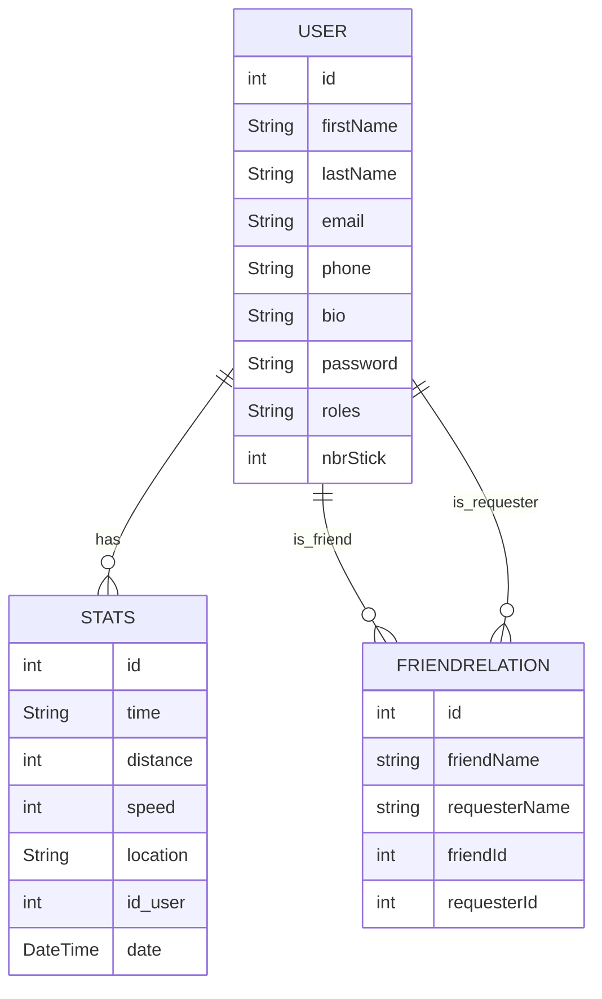

```mermaid
erDiagram
    USER ||--o{ STATS : has
    USER ||--o{ FRIENDRELATION : is_friend
    USER ||--o{ FRIENDRELATION : is_requester
    USER {
        int id
        String firstName
        String lastName
        String email
        String phone
        String bio
        String password
        String roles
        int nbrStick
    }
    STATS {
        int id
        String time
        int distance
        int speed
        String location
        int id_user
        DateTime date
    }
    FRIENDRELATION {
        int id
        string friendName
        string requesterName
        int friendId
        int requesterId
    }
```