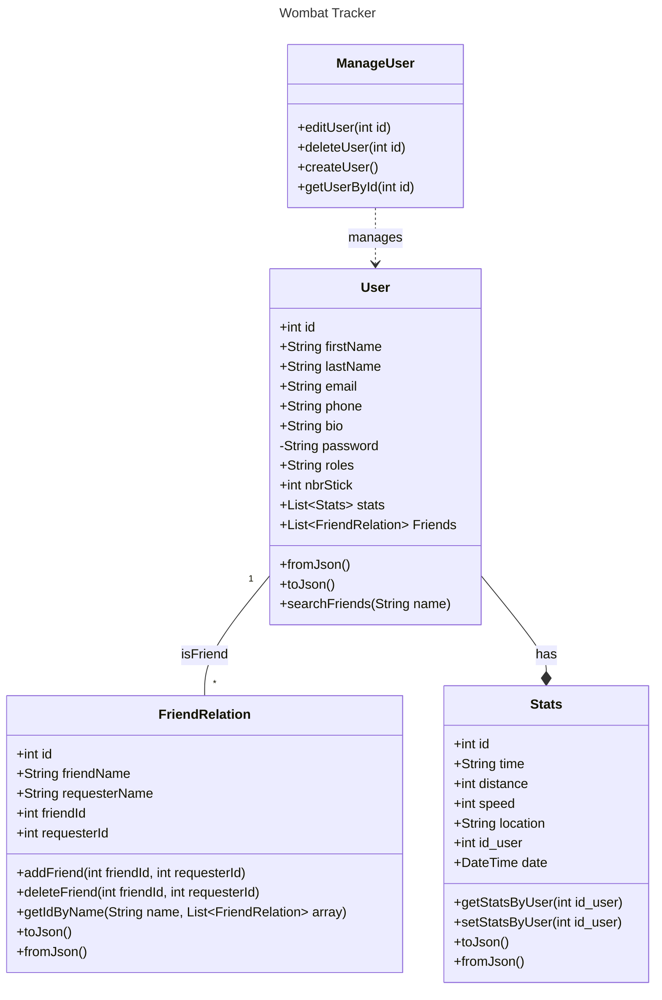

```mermaid

---
title: Wombat Tracker
---

classDiagram
    class User {
        +int id
        +String firstName
        +String lastName
        +String email
        +String phone
        +String bio
        -String password
        +String roles
        +int nbrStick
        +List~Stats~ stats
        +List~FriendRelation~ Friends
        +fromJson()
        +toJson()
        +searchFriends(String name)
    }

    class Stats {
        +int id
        +String time
        +int distance
        +int speed
        +String location
        +int id_user
        +DateTime date
        +getStatsByUser(int id_user)
        +setStatsByUser(int id_user)
        +toJson()
        +fromJson()
    }

    User "1" -- "*" FriendRelation : isFriend
    User --* Stats : has
    ManageUser ..> User : manages

    class FriendRelation {
        +int id
        +String friendName
        +String requesterName
        +int friendId
        +int requesterId
        +addFriend(int friendId, int requesterId)
        +deleteFriend(int friendId, int requesterId)
        +getIdByName(String name, List~FriendRelation~ array)
        +toJson()
        +fromJson()
    }

    class ManageUser {
        +editUser(int id)
        +deleteUser(int id)
        +createUser()
        +getUserById(int id)
    }
```
